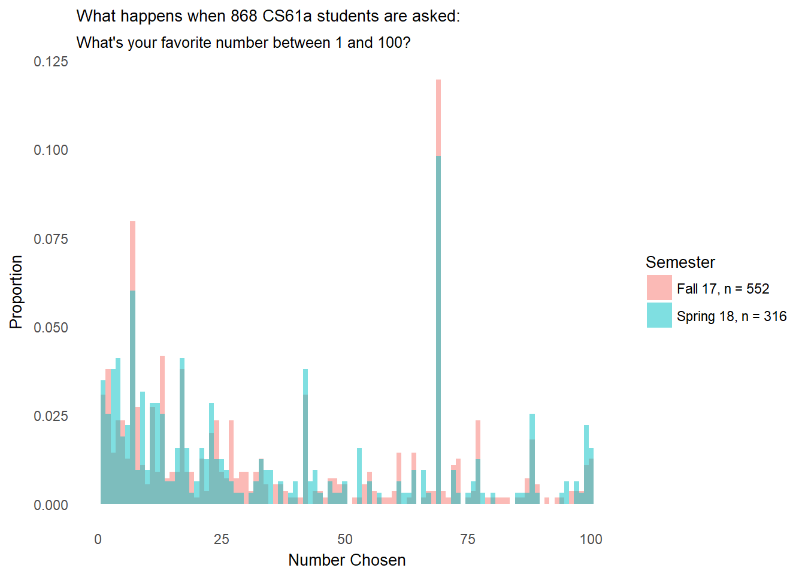

CS61A Student Data
================

``` r
library(ggplot2)
sp18data = read.csv("data/sp18data.csv")
fa17data = read.csv("data/fa17data.csv")

sp_numbers = sp18data[2][[1]]
fa_numbers = fa17data[2][[1]]

chosen_numbers = c(sp_numbers, fa_numbers)
semester = c(rep("Spring 18, n = 316", length(sp_numbers)), rep("Fall 17, n = 552", length(fa_numbers)))

student_data = data.frame(chosen_numbers = chosen_numbers, Semester = semester)

ggplot(student_data, aes(chosen_numbers, colors = Semester, fill = Semester)) + geom_histogram(aes(y =..density..), position = "Identity", alpha = .5, bins = 100) + xlab("Number Chosen") + ylab("Proportion") + theme_minimal() + ggtitle("What happens when 868 CS61a students are asked:", subtitle = "What's your favorite number between 1 and 100?") + theme(panel.grid = element_blank(), plot.title = element_text(size = 10), legend.title = element_text(size = 10), axis.title = element_text(size = 10)) 
```


